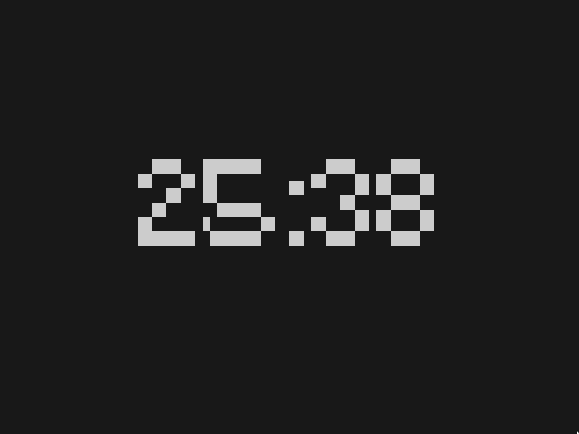

# Crono

Dependencies:
[SDL2](https://www.libsdl.org/), 
[SDL_ttf](https://github.com/libsdl-org/SDL_ttf)



## Build

```shell
$ cd crono/2023
$ ./build.sh
```

## Installation

```shell
$ cd crono/2023
$ ./build.sh
$ sudo ./install.sh
```

## Usage
```shell
$ ./crono MINUTES [START_COMMAND PAUSE/END_COMMAND]
```

### Examples
```shell
$ ./crono 30 "timew start task1" "timew stop"
```
```shell
$ ./crono 30
```

### key bindings

- `space`: Pauses time and executes PAUSE/END_COMMAND or resumes time and executes START_COMMAND.

- `q`: Quit
